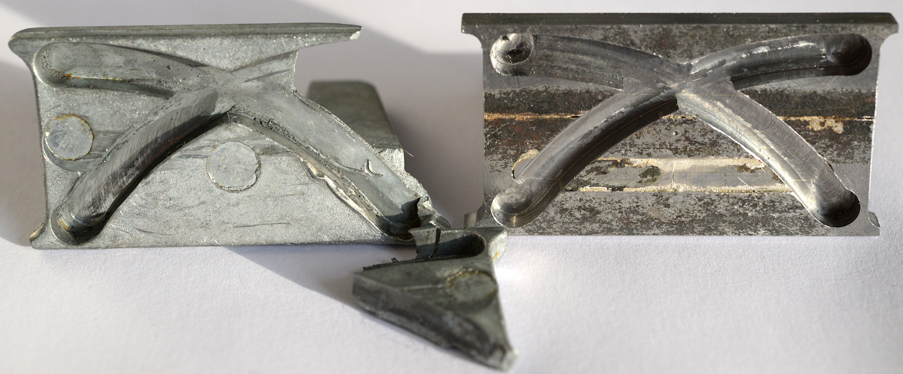

# Examples

This folder contains examples of using `libgcode` to make nc programs.

Part of the design includes a `Config` object, with properties about the
endmill, feedrate, depth of cut, etc.
To factor out some of the boilerplate, a program extends the `Program` class,
which takes a configuration as constructor argument.
Inside a program, one needs to define the `body` method, which returns a
`Seq[Command]`.
The program has predefined `header` and `footer`, which can be overridden.

Each example is a program that generates g-code file(s) in `out/`.
Run one from the repository root:

```sh
sbt "examples/runMain examples.Slots"
```

Then watch the result with [nc_viewer](https://github.com/dzufferey/nc_viewer),
which re-renders the file whenever it changes:

```sh
cd nc_viewer
npm install
npm start -- /path/to/libgcode/examples/out/slots_for_tnuts.nc
```

## Examples

| example | output | description |
| --- | --- | --- |
| `examples.Slots` | `out/slots_for_tnuts.nc` | slots for T-nuts |
| `examples.Surface` | `out/surface_100x120x2mm.nc` | flat surface milling, with finishing pass |
| `examples.Pocket` | `out/block_inner_*.nc`, `out/block_outer_*.nc` | pocketing a block, in two setups (bulk, then sides) |
| `examples.TurnersCube` | `out/cube_face.nc`, `out/cube_holes.nc`, `out/cube_chamfer.nc` | a turner's cube: facing, holes, chamfering |
| `examples.WindowSlider` | `out/window.nc`, `out/window_test_4mm.nc` | window slider, trochoidal milling |
| `examples.Heart` | `out/heart.nc`, `out/heart_outline.nc`, `out/hole_*.nc` | a heart-shaped birthday present with a candle hole |

The `WindowSlider` example is a reverse engineered replacement part:


